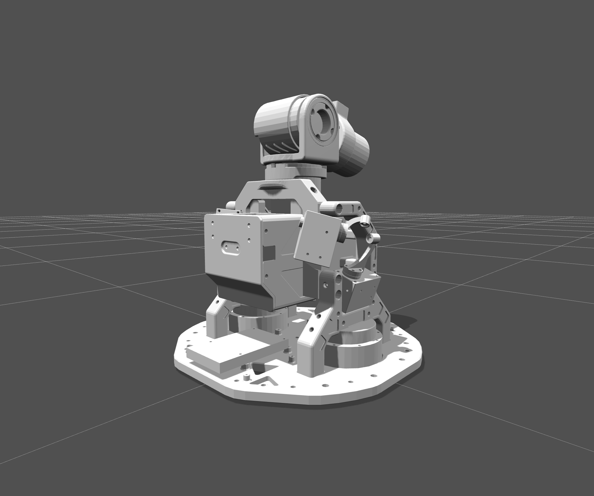

# Dreambo Robot Descriptions

---

## Dreambo Torso Description



### 1. Cardanic / Gimbal-driven Spherical Joint (串联双轴正交驱动球形关节)

题目所描述的结构在机构学里有一个明确的、规范的名字：

> **二自由度万向节式球形关节**（Cardan / Hooke / Universal Joint, 2-DOF Spherical Joint），由 **两路 RSSR（Revolute–Spherical–Spherical–Revolute）四连杆推杆** 远程并联驱动。

也常见的别名：

| 角度 | 名称 |
|---|---|
| 关节本体（铰链拓扑） | **Cardan 关节 / Hooke 铰 / 万向节（Universal Joint）** |
| 整体功能 | **2 轴云台（Pan-Tilt Gimbal）** |
| 驱动方式 | **双连杆推杆驱动 / RSSR push-rod linkage drive** |
| 自由度 | 2-DOF (yaw + pitch)，绕同一球心 |

机构本体（抱箍 + 圆柱十字轴）在运动学上与汽车传动轴里的 Cardan/Hooke 万向节 **完全同构**。区别仅在于这里把万向节当成"末端执行器"用，并用两个舵机 + 摆臂 + 推杆把 yaw / pitch 两个旋转自由度分别远程驱动。

---

### 2. 结构组成 / Components

```
  ┌──────────────────────────────────────────────────────────┐
  │                       Frame / Base                        │
  │                                                           │
  │   ┌────────┐                              ┌────────┐      │
  │   │Servo 1 │── crank ── rod ─┐    ┌─ rod ──crank ──│Servo 2│
  │   │ (yaw)  │                 │    │              │ (pitch)│
  │   └────────┘                 ▼    ▼              └────────┘
  │                          ┌──────────┐                     │
  │                          │  Yoke    │ ←─ rotates 360° (Z) │
  │                          │ (抱箍)   │                     │
  │                          │   ┌──┐   │                     │
  │                          │   │  │←──┼── Cross / Spider     │
  │                          │   └──┘   │   (圆柱体, 4 切面)    │
  │                          └────┬─────┘                     │
  │                               │                           │
  │                          Output shaft                     │
  │                          (根部 ≡ 球心)                    │
  └──────────────────────────────────────────────────────────┘
```

| # | 部件 | 描述 |
|---|---|---|
| 1 | **Frame / 机架** | 固定参考系，承载两个舵机 |
| 2 | **Yoke / 抱箍 (yaw ring)** | U 形件，可绕外轴 (Z) 自由旋转 360°；其两个相对内壁各有一根**短轴**（销钉）指向中心 |
| 3 | **Cross / 圆柱十字轴 (spider)** | 一段圆柱，被切出 4 个相互垂直的两两相对的平面：<br>• **2 个相对平面**：盲孔，承接抱箍上的两根短轴 → 形成**内轴 (Y)**<br>• **另 2 个相对平面**：通孔，让 servo 2 的推杆穿过 → 形成**外轴 (X)**，与内轴正交且共点（球心） |
| 4 | **Output shaft / 输出杆（"根部"）** | 沿圆柱体一端伸出，其根部 = 两正交轴的交点 = **球心 (Spherical Center)** |
| 5 | **Servo 1 + 摆臂 + 推杆 (yaw 驱动)** | 摆臂一端固定在 servo 1 舵盘，另一端通过球副 (small ball-link) 连到抱箍上的销孔；舵机旋转 → 抱箍绕 Z 转 |
| 6 | **Servo 2 + 摆臂 + 推杆 (pitch 驱动)** | 摆臂一端固定在 servo 2 舵盘，另一端穿过圆柱体的两个通孔切面（同时起销轴作用）→ 圆柱体绕 Y 在抱箍内俯仰 |

> **关键几何约束**：抱箍的两根短轴中线 与 servo 2 推杆中线 **正交且共点**，这一点就是题目说的"球心"，输出杆永远绕这个固定点摆动，不会平移。

---

### 3. 工作原理 / Kinematic Principle

铰链拓扑（不含驱动）：

```
ground ──R(Z, yaw)── yoke ──R(Y, pitch)── cross ── output shaft
```

这就是一个标准的 Cardan / Hooke 关节（U-pair）：两个串联的、彼此正交的转动副，旋转轴交于一点 → 输出杆的姿态可以用一对欧拉角 `(θ_yaw, θ_pitch)` 完整描述。

驱动拓扑：每路舵机都通过一段 **RSSR 平面四杆机构** 远程把转动从舵盘传到关节：

```
servo horn (R) ── crank ── (S) ── push rod ── (S) ── output rocker (R about joint axis)
```

- **R** = revolute（舵机轴 / 关节轴）
- **S** = spherical（推杆两端的球头扣，或一头球头一头销轴的近似球副）

整机 DOF 计算（Grübler）：忽略球副自旋，2 个独立输入舵机 ⇒ 输出 2 DOF，机构非冗余、非欠驱动，**可解析求解**。

---

### 4. 运动学 / Kinematics

#### 4.1 正运动学 (FK)

输出杆（默认沿 +Z 出射）经过 yaw → pitch 串联旋转后的方向：

```
R(θ_yaw, θ_pitch) = R_z(θ_yaw) · R_y(θ_pitch)

n̂ = R · ẑ = [ cos(θ_yaw)·sin(θ_pitch),
              sin(θ_yaw)·sin(θ_pitch),
              cos(θ_pitch) ]ᵀ
```

#### 4.2 逆运动学 — 把关节角解算成舵机角

每一路 RSSR 推杆都可以投影到一个**平面四杆**问题（servo 转轴与关节轴各自所在平面）。在该平面内的几何参数：

| 符号 | 含义 |
|---|---|
| `O_s = (x_s, y_s)` | 舵机舵盘中心（crank 的固定铰点） |
| `L_a` | 摆臂（crank）长度 |
| `L_r` | 推杆长度 |
| `L_o` | 关节侧摇杆长度（球心到推杆末端的距离） |
| `θ_0` | 关节角 = 0 时摇杆相对于平面 X 轴的方位角 |
| `θ_j` | 期望关节角（yaw 通道用 θ_yaw，pitch 通道用 θ_pitch） |
| `θ_s` | 待求的舵机转角 |

闭环约束 `‖P_crank − P_rocker‖ = L_r` 展开得：

```
P_o = ( L_o·cos(θ_0 + θ_j),  L_o·sin(θ_0 + θ_j) )

u   = x_s − P_o.x
v   = y_s − P_o.y
R   = √(u² + v²)
φ   = atan2(v, u)
K   = ( L_r² − L_a² − R² ) / ( −2 · L_a · R )

θ_s = φ + π ± acos(K)         (± 选支由装配方向决定)
```

可行性：装配条件 `|K| ≤ 1`，否则期望角超出推杆能达到的工作空间。

#### 4.3 舵机角 → SM40BL 位置码

本项目实际使用 **FEETECH SM40BL**（无刷总线伺服，**RS-485 半双工差分总线**，FEETECH SMS-BL 协议）。它不接 PWM，而是挂到一对差分线 (A/B) 上，靠 ID 寻址，位置以 **12-bit 整数码 (0..4095)** 给出，对应 **0°..360°**（出厂默认；2048 即机械中位）。

把上一步求得的 `θ_s` (rad) 转成位置码：

```
pos = round( 2048 + θ_s · (4096 / 2π) ) − offset_id
pos = clip(pos, 0, 4095)
```

`offset_id` 是该舵机的零位标定值（让关节回正时此舵机的 raw count）。SM40BL 常用控制表寄存器（具体地址以官方 SMS-BL 手册为准）：

| 名称 | 地址 | 字节 | 含义 |
|---|---|---|---|
| Torque Enable | 40 (0x28) | 1 | 0=自由 / 1=保持 |
| Goal Position | 42 (0x2A) | 2 (LE) | 0..4095 |
| Goal Time | 44 (0x2C) | 2 (LE) | 到位耗时 ms (0=最快) |
| Goal Speed | 46 (0x2E) | 2 (LE) | 步/s, 0=最大 |
| Present Position | 56 (0x38) | 2 (LE) | 实时位置 |

> **注意**：SM-BL 系列虽然包格式（`FF FF ID LEN INST ADDR ... CHK`）与 FEETECH 的 STS/SCS 同源，但物理层是 **RS-485**，不是 TTL UART —— 必须通过 USB↔RS-485 适配器（或 RS-485 收发芯片如 MAX485 / ADM2483）接入，**不能直接用 USB-TTL**。

---

### 5. Python 参考实现 / Python Reference Implementation

下面给出**纯几何解算 + FEETECH SM40BL RS-485 总线驱动**：用 `pyserial` 通过 USB↔RS-485 适配器收发 SMS-BL 协议包（也可改用官方 `feetech_servo_sdk` / `scservo_sdk`，注释里给出对应 API）。

#### 5.1 `cardan_kinematics.py` — 解算 + 抽象舵机后端

```python
"""
Cardan / U-joint 2-DOF gimbal kinematics + servo driver abstraction.
Author: dreambo_description
"""
from __future__ import annotations
import math
import time
from dataclasses import dataclass
from typing import Protocol


# ----------------------------------------------------------------------
# 1. 单路 RSSR 推杆解算
# ----------------------------------------------------------------------
@dataclass
class LinkageGeometry:
    """Planar 4-bar (RSSR) parameters projected into the linkage's working plane."""
    O_s:   tuple[float, float]   # servo pivot (x, y) [mm]
    L_a:   float                 # crank / servo horn length [mm]
    L_r:   float                 # push rod length [mm]
    L_o:   float                 # output rocker length (joint center to rod end) [mm]
    theta_0: float               # rocker offset (rad) when joint angle == 0
    branch: int = +1             # +1 or -1 : assembly elbow-up / elbow-down
    servo_zero: float = 0.0      # servo angle (rad) corresponding to theta_s solved as 0


def joint_angle_to_servo_angle(theta_j: float, g: LinkageGeometry) -> float:
    """Inverse kinematics of one RSSR push-rod linkage.

    Returns the servo crank angle (rad) that places the joint at theta_j (rad).
    Raises ValueError if theta_j is outside the linkage's reachable workspace.
    """
    P_ox = g.L_o * math.cos(g.theta_0 + theta_j)
    P_oy = g.L_o * math.sin(g.theta_0 + theta_j)

    u = g.O_s[0] - P_ox
    v = g.O_s[1] - P_oy
    R = math.hypot(u, v)
    if R < 1e-9:
        raise ValueError("Servo pivot coincides with rocker tip - degenerate geometry.")

    phi = math.atan2(v, u)
    K   = (g.L_r ** 2 - g.L_a ** 2 - R ** 2) / (-2.0 * g.L_a * R)
    if not -1.0 <= K <= 1.0:
        raise ValueError(f"theta_j={math.degrees(theta_j):.2f}° out of linkage workspace (K={K:.3f}).")

    theta_s = phi + math.pi + g.branch * math.acos(K)
    # wrap into (-pi, pi]
    theta_s = (theta_s + math.pi) % (2 * math.pi) - math.pi
    return theta_s - g.servo_zero


# ----------------------------------------------------------------------
# 2. 整机：两路串联 (yaw, pitch)
# ----------------------------------------------------------------------
@dataclass
class CardanGimbal:
    yaw_linkage:   LinkageGeometry
    pitch_linkage: LinkageGeometry

    def ik(self, theta_yaw: float, theta_pitch: float) -> tuple[float, float]:
        """Return (servo_yaw_rad, servo_pitch_rad) for desired joint angles."""
        return (
            joint_angle_to_servo_angle(theta_yaw,   self.yaw_linkage),
            joint_angle_to_servo_angle(theta_pitch, self.pitch_linkage),
        )

    @staticmethod
    def fk(theta_yaw: float, theta_pitch: float) -> tuple[float, float, float]:
        """Forward kinematics: return unit vector of output shaft (default along +Z)."""
        cy, sy = math.cos(theta_yaw),   math.sin(theta_yaw)
        cp, sp = math.cos(theta_pitch), math.sin(theta_pitch)
        return (cy * sp, sy * sp, cp)


# ----------------------------------------------------------------------
# 3. 舵机驱动后端 — FEETECH SM40BL (STS/SCS 协议)
# ----------------------------------------------------------------------
class ServoBackend(Protocol):
    def write_angle(self, servo_id: int, angle_rad: float) -> None: ...


class SM40BLBackend:
    """Drive FEETECH SM40BL brushless bus servos over half-duplex RS-485.

    Wiring: PC ── USB↔RS-485 adapter (A/B differential) ── SM40BL bus
            + 独立电机供电 (12 V / ≥ 3 A) + 总线终端 120 Ω (长线时)
    Default factory settings: typically 1 Mbps, ID 1, 0..4095 counts over 0°..360°.
    The wire-format packet is FEETECH SMS-BL (header FF FF, same framing as STS),
    only the physical layer is RS-485 instead of TTL.

    pip install pyserial
    (Or use FEETECH's official SDK: `pip install feetech-servo-sdk` /
     `scservo_sdk` — same packet, just point its PortHandler at the
     USB-RS485 COM port.)

    Auto-direction USB-RS485 adapters (CH340/FT232 + MAX485 with auto DE/RE)
    are recommended; with manual DE/RE adapters you must toggle RTS in
    `_write` before/after the bytes are flushed.
    """

    # SMS-BL control table addresses (same layout as STS family)
    ADDR_TORQUE_ENABLE   = 40
    ADDR_GOAL_POSITION   = 42
    ADDR_GOAL_TIME       = 44
    ADDR_GOAL_SPEED      = 46
    ADDR_PRESENT_POSITION = 56

    # Instructions
    INST_WRITE = 0x03

    COUNTS_PER_REV = 4096
    CENTER_COUNT   = 2048

    def __init__(self, port: str, baud: int = 1_000_000, timeout: float = 0.05,
                 default_speed: int = 0, default_time_ms: int = 0,
                 manual_de_re: bool = False):
        import serial                                       # noqa: F401 (lazy import)
        self._ser = serial.Serial(port, baud, timeout=timeout)
        self._speed = default_speed       # 0 = max
        self._time  = default_time_ms     # 0 = use speed
        self._manual_de_re = manual_de_re # True if 485 adapter needs RTS toggling
        self._zero_offset: dict[int, int] = {}              # per-id offset in counts

    # ---- public API -----------------------------------------------------
    def set_zero_offset(self, servo_id: int, offset_counts: int) -> None:
        """Set the raw count that should map to angle = 0."""
        self._zero_offset[servo_id] = int(offset_counts)

    def torque(self, servo_id: int, on: bool) -> None:
        self._write(servo_id, self.ADDR_TORQUE_ENABLE, bytes([1 if on else 0]))

    def write_angle(self, servo_id: int, angle_rad: float) -> None:
        pos = self._angle_to_counts(servo_id, angle_rad)
        # 6-byte payload: pos_lo, pos_hi, time_lo, time_hi, speed_lo, speed_hi
        payload = (
            pos.to_bytes(2, "little")
            + self._time.to_bytes(2, "little")
            + self._speed.to_bytes(2, "little")
        )
        self._write(servo_id, self.ADDR_GOAL_POSITION, payload)

    # ---- helpers --------------------------------------------------------
    def _angle_to_counts(self, servo_id: int, angle_rad: float) -> int:
        raw = self.CENTER_COUNT + int(round(angle_rad * self.COUNTS_PER_REV / (2 * math.pi)))
        raw -= self._zero_offset.get(servo_id, 0)
        return max(0, min(self.COUNTS_PER_REV - 1, raw))

    def _write(self, servo_id: int, address: int, data: bytes) -> None:
        # FEETECH SMS-BL packet (RS-485): FF FF ID LEN INST ADDR DATA... CHK
        length = len(data) + 3                               # INST + ADDR + DATA + CHK_excl
        body = bytes([servo_id, length, self.INST_WRITE, address]) + data
        chk = (~sum(body)) & 0xFF
        pkt = b"\xff\xff" + body + bytes([chk])
        if self._manual_de_re:
            self._ser.setRTS(True)        # drive bus (DE high, RE high)
            self._ser.write(pkt)
            self._ser.flush()             # wait for last byte to leave the UART
            self._ser.setRTS(False)       # release bus back to receive
        else:
            self._ser.write(pkt)


# ----------------------------------------------------------------------
# 4. 控制器：串接 IK + backend
# ----------------------------------------------------------------------
class GimbalController:
    def __init__(self, gimbal: CardanGimbal, backend: ServoBackend,
                 yaw_id: int = 1, pitch_id: int = 2):
        self.gimbal   = gimbal
        self.backend  = backend
        self.yaw_id   = yaw_id            # SM40BL ID on the TTL bus
        self.pitch_id = pitch_id

    def go_to(self, theta_yaw_deg: float, theta_pitch_deg: float) -> None:
        ty, tp = math.radians(theta_yaw_deg), math.radians(theta_pitch_deg)
        sy, sp = self.gimbal.ik(ty, tp)
        self.backend.write_angle(self.yaw_id,   sy)
        self.backend.write_angle(self.pitch_id, sp)

    def sweep(self, yaw_range_deg=(-30, 30), pitch_range_deg=(-20, 20),
              steps: int = 60, period_s: float = 4.0) -> None:
        """Lissajous-like demo sweep."""
        dt = period_s / steps
        for i in range(steps + 1):
            t = i / steps
            y = yaw_range_deg[0]   + (yaw_range_deg[1]   - yaw_range_deg[0])   * 0.5 * (1 - math.cos(2 * math.pi * t))
            p = pitch_range_deg[0] + (pitch_range_deg[1] - pitch_range_deg[0]) * 0.5 * (1 - math.cos(4 * math.pi * t))
            self.go_to(y, p)
            time.sleep(dt)
```

#### 5.2 `demo.py` — 演示：用 SM40BL 让输出杆走一个 Lissajous 轨迹

```python
"""Demo: drive the Cardan gimbal with two FEETECH SM40BL bus servos."""
import math
from cardan_kinematics import (
    LinkageGeometry, CardanGimbal,
    SM40BLBackend, GimbalController,
)

# ---- 1. 把你机构的实测/CAD 几何填进来 (单位 mm, rad) ----
yaw_link = LinkageGeometry(
    O_s        = (-32.0,  18.0),     # yaw 舵机舵盘中心 (在 yaw 平面内)
    L_a        = 12.0,               # 摆臂长
    L_r        = 38.0,               # 推杆长
    L_o        = 14.0,               # 抱箍上铰点到 Z 轴距离
    theta_0    = math.radians(110),  # θ_yaw=0 时摇杆方位
    branch     = +1,
    servo_zero = 0.0,                # SM40BL 在 backend 侧用 set_zero_offset 标定
)

pitch_link = LinkageGeometry(
    O_s        = ( 30.0,  20.0),
    L_a        = 12.0,
    L_r        = 36.0,
    L_o        = 13.5,
    theta_0    = math.radians(70),
    branch     = -1,
    servo_zero = 0.0,
)

gimbal = CardanGimbal(yaw_linkage=yaw_link, pitch_linkage=pitch_link)

# ---- 2. RS-485 总线后端：SM40BL 通过 USB↔RS-485 适配器接到电脑 ----
#    Windows: "COM5"   Linux/macOS: "/dev/ttyUSB0"
#    若用了带自动 DE/RE 的 485 适配器，manual_de_re=False；否则置 True。
backend = SM40BLBackend(port="COM5", baud=1_000_000,
                        default_time_ms=0, default_speed=2400,
                        manual_de_re=False)

# 总线上 yaw=ID1, pitch=ID2 (用 FEETECH 调试器 FD 预先烧录好 ID)
YAW_ID, PITCH_ID = 1, 2

# 标定零位：让两条连杆物理回中后，从舵机读出 Present Position，把 raw count 填入
backend.set_zero_offset(YAW_ID,   0)     # e.g. 实测 raw=2105 ⇒ offset=57
backend.set_zero_offset(PITCH_ID, 0)

# 上电后默认是 free，需要使能力矩
backend.torque(YAW_ID,   True)
backend.torque(PITCH_ID, True)

ctrl = GimbalController(gimbal, backend, yaw_id=YAW_ID, pitch_id=PITCH_ID)

# ---- 3. 跑演示 ----
if __name__ == "__main__":
    ctrl.go_to(0.0, 0.0)            # 回中
    ctrl.sweep(yaw_range_deg=(-25, 25),
               pitch_range_deg=(-15, 15),
               steps=120, period_s=6.0)
    ctrl.go_to(0.0, 0.0)
```

#### 5.3 接线 / 上电要点（FEETECH SM40BL，RS-485）

- **总线物理层是 RS-485**，**不是 TTL UART**。SM40BL 的接线一般是 4 线：`VCC` / `GND` / `485-A` / `485-B`。所有 SM40BL 的 A 并 A、B 并 B，接到 USB↔RS-485 适配器；电机供电必须**独立**（典型 12 V / ≥3 A），适配器只承担信号。
- **总线收发器**：推荐用带自动方向（auto DE/RE）的 USB↔485 适配器（如 FT232 + ADM2483、CH340 + 自动 485 模块）；若适配器需要手动控制 DE/RE，把 `manual_de_re=True` 让代码用 RTS 切换收发。
- **终端电阻**：长走线（>1 m）或菊花链多个舵机时，在物理总线两端各加一个 120 Ω 终端电阻可显著改善信号完整性。
- **ID 与波特率**：出厂默认 ID=1 / 1 Mbps。两个舵机不能共 ID，先用 FEETECH 上位机（FD 调试软件 + 官方 USB-485 调试器）把 yaw 设为 ID=1、pitch 设为 ID=2。
- **力矩使能**：每次上电后默认无力矩（自由状态），先 `backend.torque(id, True)` 再下发位置。
- **限速**：`default_speed`（步/s）和 `default_time_ms` 二选一非零即可，速度 0 = 最大，跑 demo 前建议先设到 1000–3000 步/s 防止甩动过冲。

---

### 6. 标定建议 / Calibration Notes

1. **几何参数先量后调**：`O_s, L_a, L_r, L_o, θ_0` 先用 CAD 或卡尺量出来，跑 IK 比较 servo 实际角度是否对得上。
2. **`branch` 选支**：装配后只有一个分支可达，把 `branch = ±1` 切换一下哪个不报错就用哪个。
3. **零位校准**：让关节物理停在 `(θ_yaw, θ_pitch) = (0, 0)`，从 SM40BL Present Position (寄存器 56) 读到的 raw count 直接填进 `backend.set_zero_offset(id, raw)`；不要用 `LinkageGeometry.servo_zero` 重复偏置。
4. **工作空间留余量**：跑 demo 前先 `for ang in range(-40,40,5): try gimbal.ik(...)`，把会抛 `ValueError` 的角度排除掉，避免硬件卡死。
5. **球副间隙**：推杆两端最好用 M3 球头扣（KY/KZ 系列），配合做一个微小自旋自由度，避免 RSSR 装配过约束导致卡顿。

---

### 7. 与传统三轴云台 / 球副的对比

| | 本机构 (RSSR×2 → Cardan) | 真正球副 (S-pair) | 串联 RPY 三轴 |
|---|---|---|---|
| 自由度 | 2 (yaw + pitch) | 3 | 通常 3 |
| 旋转中心 | **固定**于球心 | 固定 | 固定 |
| 驱动位置 | 远程，舵机可放机架上 | 通常需要把电机塞进关节 | 关节内置电机，关节质量大 |
| 解析 IK | 有闭式解 (本节 4.2) | 平凡 | 平凡 |
| 缺点 | 没有 roll；存在 RSSR 死点 | 难驱动 | 末端电机加大转动惯量 |

对躯干 / 颈部 / 肩部这种希望 **末端轻、关节中心固定、电机集中放在机架** 的场景，这种 Cardan-RSSR 双驱动方案是非常常见且高效的选择，也是本仓库 `dreambo_torso` 中肩关节的实际拓扑。
